# CloudDevOpsProject

## 1. Project Overview

CloudDevOpsProject is an end-to-end Cloud DevOps project that demonstrates how to provision AWS infrastructure, configure a Jenkins CI/CD server, containerize an application, deploy it to Amazon EKS, and implement GitOps-based Continuous Deployment using ArgoCD.

The project integrates Infrastructure as Code, Configuration Management, Containerization, CI/CD, Kubernetes, and GitOps into a complete automated workflow.

---

## 2. Technologies Used

* AWS
* Terraform
* Ansible
* Docker
* Docker Compose
* Amazon EC2
* Amazon ECR
* Amazon EKS
* Kubernetes
* Jenkins
* ArgoCD
* GitHub
* MySQL

---

# 3. Architecture Overview

The project follows a cloud-native DevOps architecture.

```text
                              GitHub
                           /          \
                          /            \
                         v              v
                    Jenkins           ArgoCD
                       |                 |
                       |                 |
                 Docker Build        GitOps Sync
                       |                 |
                       v                 v
                      ECR              EKS Cluster
                                         |
                                  +------+------+
                                  |             |
                                  v             v
                              Worker Node   Worker Node
                                  |             |
                                  +------+------+
                                         |
                              Kubernetes Namespace
                                    "ivolve"
                                         |
                  +----------------------+----------------+
                  |                      |                |
                  v                      v                v
             Frontend              Auth Service     Roadmap Service
                                                          |
                                                          v
                                                       MySQL

              Terraform ───────> AWS Infrastructure
              Ansible ─────────> Jenkins Configuration
```

### Deployment Flow

1. Terraform provisions the AWS infrastructure.
2. Ansible configures the Jenkins EC2 instance.
3. Jenkins retrieves the application source code from GitHub.
4. Jenkins builds Docker images.
5. Jenkins pushes the images to Amazon ECR.
6. Jenkins connects to the Amazon EKS cluster.
7. Kubernetes manifests define the application resources.
8. ArgoCD monitors the GitHub repository.
9. ArgoCD synchronizes the Kubernetes manifests with EKS.
10. The application runs on the EKS worker nodes.

---

# 4. AWS Infrastructure

The infrastructure is deployed in the AWS region:

```text
eu-north-1
```

The AWS environment includes:

* VPC
* Public Subnets
* Private Subnets
* Internet Gateway
* NAT Gateway
* Network ACLs
* Jenkins EC2 Instance
* IAM Role for Jenkins
* Amazon ECR Repository
* Amazon EKS Cluster
* EKS Managed Node Group
* EKS Access Configuration

### VPC

The project uses a dedicated VPC containing public and private subnets.

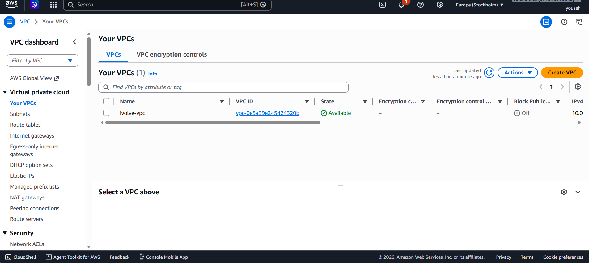

### VPC Resource Map

The AWS resource map provides an overview of the networking components and their relationships.

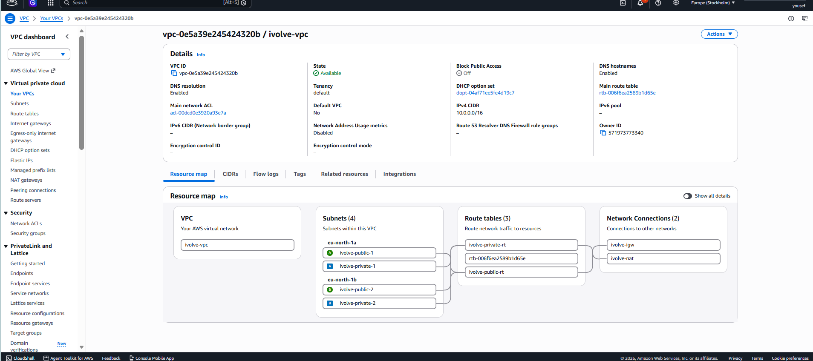

---

# 5. Jenkins Server

Jenkins is hosted on an Amazon EC2 instance.

The Jenkins server is responsible for executing the CI/CD pipeline and communicating with:

* GitHub
* Docker
* Amazon ECR
* Amazon EKS

### EC2 Jenkins Server

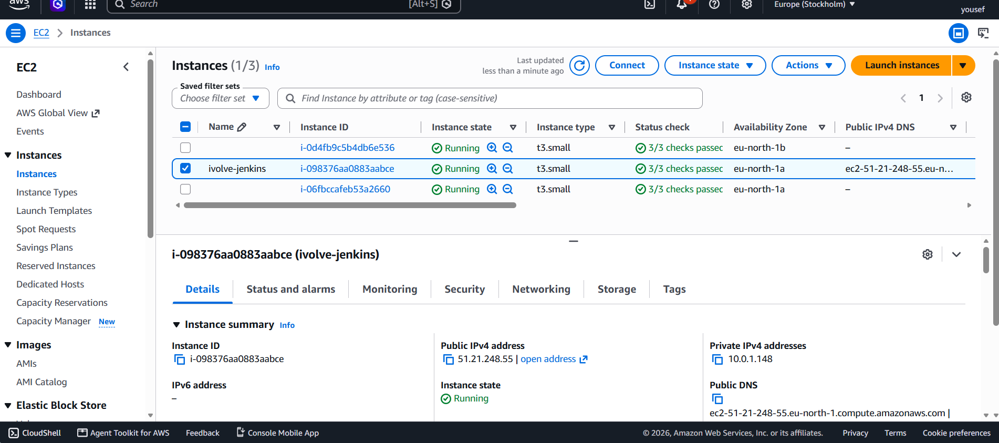

The Jenkins EC2 instance uses an IAM role that allows it to authenticate with AWS services without storing static AWS access keys on the server.

The Jenkins role is also configured with access to the EKS cluster.

---

# 6. Infrastructure as Code - Terraform

Terraform is used to provision the AWS infrastructure.

The Terraform project is organized into reusable modules:

```text
terraform/
├── modules/
│   ├── network/
│   ├── server/
│   ├── ecr/
│   └── eks/
├── backend.tf
├── main.tf
├── outputs.tf
├── providers.tf
├── variables.tf
└── terraform.tfvars
```

### Terraform Modules

#### Network Module

Responsible for:

* VPC
* Public Subnets
* Private Subnets
* Internet Gateway
* NAT Gateway
* Route Tables
* Network ACLs

#### Server Module

Responsible for:

* Jenkins EC2 instance
* IAM Role
* Instance Profile
* Security Group
* SSH Key Pair

#### ECR Module

Creates the private Amazon ECR repository used by Jenkins.

#### EKS Module

Creates:

* EKS Cluster
* EKS IAM Roles
* Managed Node Group
* OIDC Provider
* EBS CSI Add-on
* Jenkins EKS Access Entry
* EKS Access Policy

### Terraform Outputs

After provisioning the infrastructure, Terraform outputs the important AWS resource information.

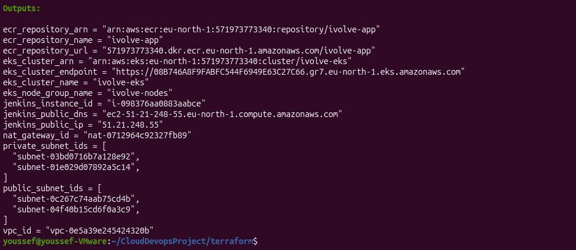

---

# 7. Configuration Management - Ansible

Ansible is used to automate the configuration of the Jenkins server.

The Ansible project contains:

```text
ansible/
├── ansible.cfg
├── inventory/
├── playbooks/
└── roles/
```

Ansible roles are used to install and configure required components including:

* Java
* Jenkins
* Trivy

This provides a repeatable and automated Jenkins server configuration.

---

# 8. Containerization - Docker

The application contains three main services:

* Auth Service
* Roadmap Service
* Frontend

Each service has its own Dockerfile:

```text
iVolveFinalProject/
├── auth-service/
│   └── Dockerfile
├── roadmap-service/
│   └── Dockerfile
└── frontend/
    └── Dockerfile
```

Docker Compose is also included for local application testing.

```bash
docker compose up --build
```

---

# 9. Amazon ECR

Amazon ECR is used as the private container registry.

Repository:

```text
ivolve-app
```

Region:

```text
eu-north-1
```

Jenkins authenticates to ECR using the AWS IAM role attached to the EC2 instance.

The pipeline builds and pushes three application images:

```text
auth-service
roadmap-service
frontend
```

Images are tagged using the Jenkins build number.

Example:

```text
auth-<BUILD_NUMBER>
roadmap-<BUILD_NUMBER>
frontend-<BUILD_NUMBER>
```

### ECR Repository

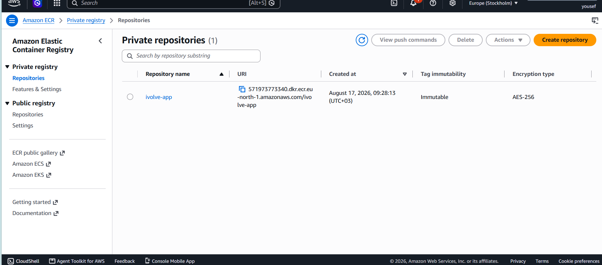

---

# 10. Jenkins CI/CD Pipeline

The CI/CD pipeline is defined in:

```text
Jenkinsfile
```

The pipeline performs the following stages:

```text
Checkout
    ↓
Build Docker Images
    ↓
Login to ECR
    ↓
Push Images to ECR
    ↓
Configure EKS
    ↓
Deploy to EKS
    ↓
Deployment Status
```

### Checkout

Jenkins checks out the project source code from GitHub.

### Build Docker Images

Jenkins builds Docker images for:

* Auth Service
* Roadmap Service
* Frontend

### Login to ECR

Jenkins authenticates Docker with Amazon ECR using:

```bash
aws ecr get-login-password
```

### Push Images

The generated Docker images are pushed to the ECR repository.

### Configure EKS

Jenkins configures Kubernetes access using:

```bash
aws eks update-kubeconfig
```

### Deploy to EKS

The pipeline applies the Kubernetes manifests and updates the application deployments with the new image tags.

### Deployment Status

The pipeline verifies that the deployments become ready using:

```bash
kubectl rollout status
```

### Jenkins Pipeline

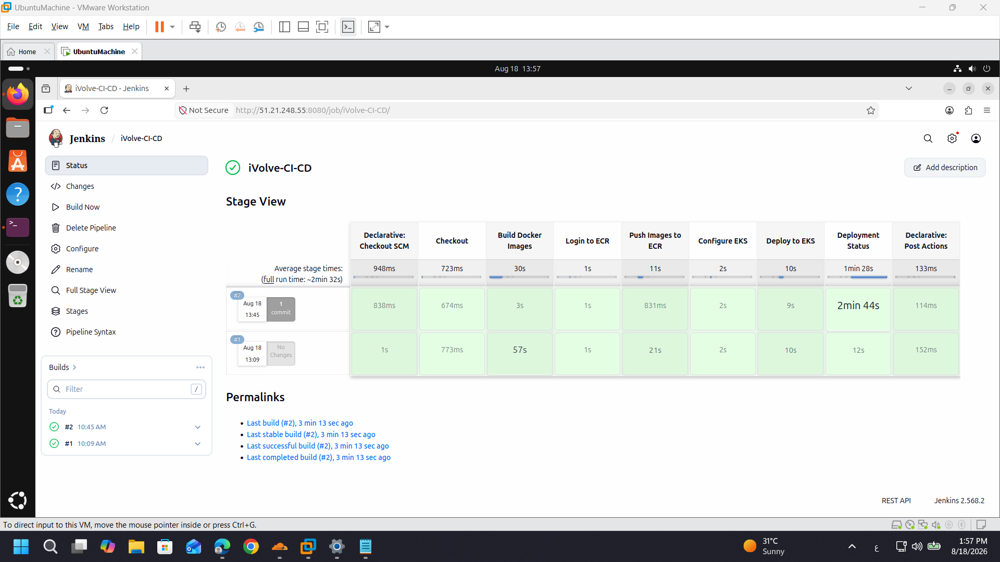

---

# 11. Amazon EKS

The application is deployed to an Amazon EKS cluster.

Cluster name:

```text
ivolve-eks
```

Region:

```text
eu-north-1
```

The EKS cluster uses a managed node group with two worker nodes.

### EKS Cluster

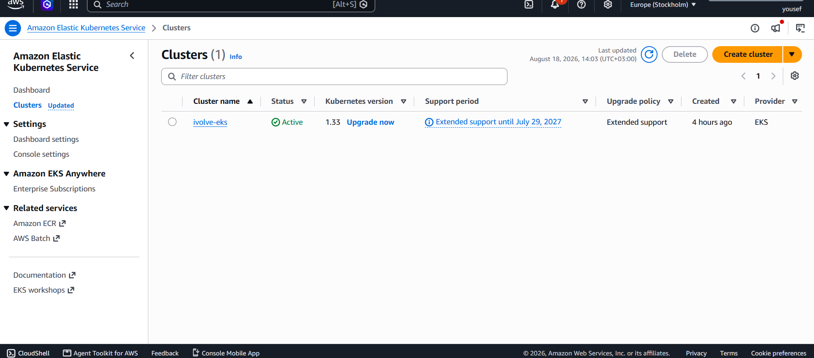

### EKS Worker Nodes

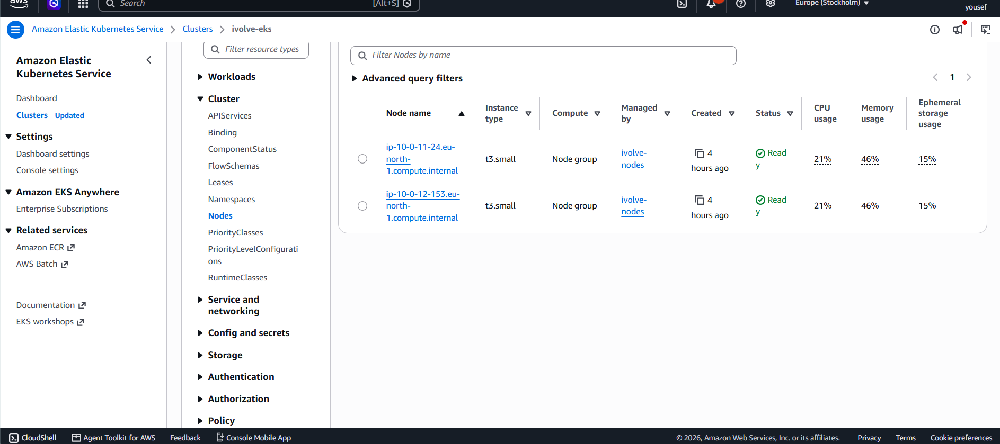

The worker nodes run inside the private subnets of the VPC.

---

# 12. Kubernetes

The application is deployed into the Kubernetes namespace:

```text
ivolve
```

The Kubernetes manifests are stored in:

```text
kubernetes/
```

The project contains manifests for:

* Namespace
* ConfigMap
* Secret
* StorageClass
* MySQL StatefulSet
* MySQL Headless Service
* Auth Service
* Roadmap Service
* Frontend
* Frontend Ingress

### Kubernetes Structure

```text
kubernetes/
├── auth-service/
│   ├── deployment.yaml
│   └── service.yaml
│
├── roadmap-service/
│   ├── deployment.yaml
│   └── service.yaml
│
├── frontend/
│   ├── deployment.yaml
│   ├── service.yaml
│   └── ingress.yaml
│
├── mysql/
│   ├── statefulset.yaml
│   └── headless-service.yaml
│
├── namespace.yaml
├── configmap.yaml
├── secret.yaml
└── storageclass.yaml
```

### Kubernetes Cluster

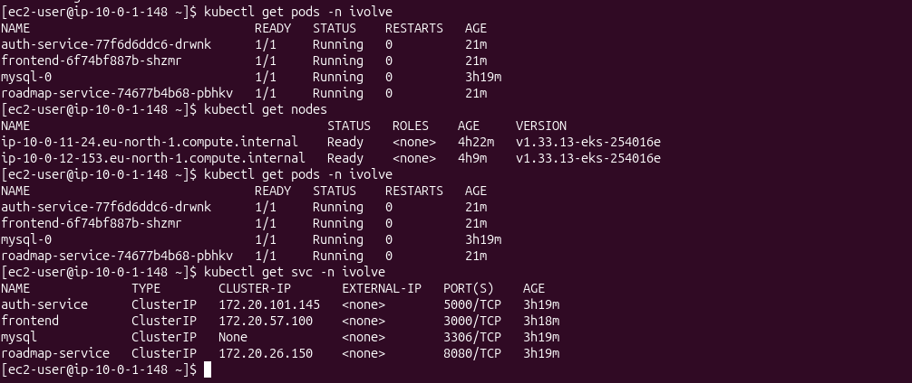

### Kubernetes Pods

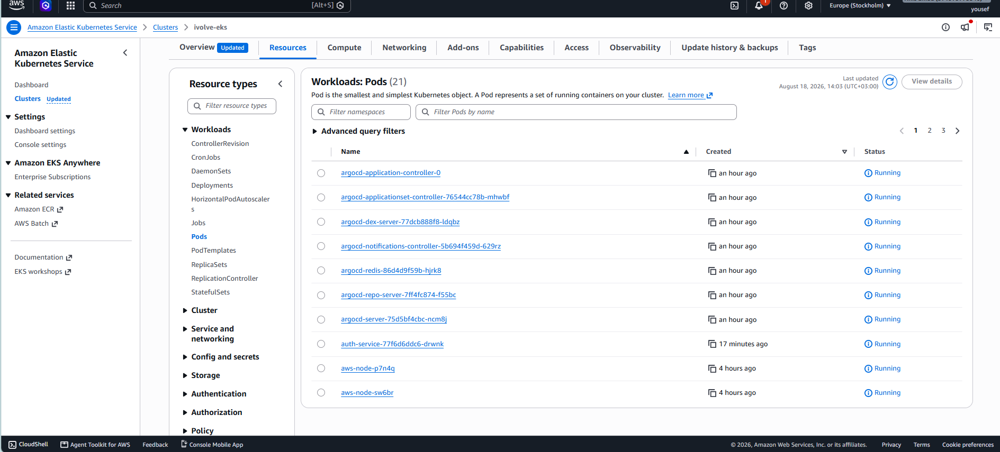

The application pods run successfully across the EKS worker nodes.

---

# 13. Application Services

The Kubernetes application contains the following services:

| Service         | Port | Type      |
| --------------- | ---: | --------- |
| Auth Service    | 5000 | ClusterIP |
| Roadmap Service | 8080 | ClusterIP |
| Frontend        | 3000 | ClusterIP |
| MySQL           | 3306 | Headless  |

The frontend communicates with the backend services through Kubernetes service discovery.

The backend services communicate with MySQL through the Kubernetes MySQL service.

---

# 14. Kubernetes Configuration

Application configuration is stored in a ConfigMap.

Example:

```yaml
data:
  DB_NAME: "ivolve"
  DB_PORT: "3306"
  AUTH_SERVICE_URL: "http://auth-service:5000"
  ROADMAP_SERVICE_URL: "http://roadmap-service:8080"
```

Sensitive application values are stored in a Kubernetes Secret.

The Secret contains:

```text
DB_ROOT_PASSWORD
DB_USER
DB_PASSWORD
SESSION_SECRET
```

The manifest uses Kubernetes `data` fields with Base64-encoded values.

> **Security Note:** Base64 is an encoding mechanism and does not provide encryption. For production environments, a dedicated secret-management solution such as AWS Secrets Manager or another secure secret store should be considered.

---

# 15. ArgoCD - GitOps Continuous Deployment

ArgoCD is used to implement GitOps-based Continuous Deployment.

The ArgoCD Application manifest is:

```text
argocd/ivolve-app.yaml
```

The Application monitors the GitHub repository:

```text
https://github.com/YoussefNessem/CloudDevOpsProject.git
```

Branch:

```text
main
```

Kubernetes manifests path:

```text
kubernetes
```

Target namespace:

```text
ivolve
```

### Automated Synchronization

ArgoCD is configured with automated synchronization:

```yaml
syncPolicy:
  automated:
    prune: true
    selfHeal: true
```

This enables:

* Automatic synchronization
* Automatic pruning of deleted resources
* Self-healing when configuration drift occurs

### ArgoCD Application

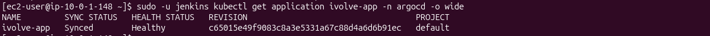

The deployed ArgoCD Application reached:

```text
SYNC STATUS: Synced
HEALTH STATUS: Healthy
```

---

# 16. GitOps Workflow

The final deployment workflow is:

```text
                    GitHub
                       |
             +---------+---------+
             |                   |
             v                   v
          Jenkins              ArgoCD
             |                   |
       Docker Build              |
             |                   |
             v                   v
            ECR                 EKS
                                 |
                         Kubernetes Cluster
                                 |
                   +-------------+-------------+
                   |             |             |
                   v             v             v
               Frontend     Auth Service   Roadmap Service
                                                |
                                                v
                                              MySQL
```

### Continuous Integration

Jenkins performs:

```text
GitHub
   ↓
Checkout
   ↓
Docker Build
   ↓
ECR Login
   ↓
Push Images
```

### Continuous Deployment

ArgoCD performs:

```text
GitHub
   ↓
Detect Changes
   ↓
Sync
   ↓
EKS
   ↓
Kubernetes
```

This separates the CI process from the GitOps-based deployment process.

---

# 17. Setup Instructions

## Prerequisites

Install:

* Git
* AWS CLI
* Terraform
* Ansible
* Docker
* kubectl

AWS credentials or an appropriate IAM role must be available.

Verify AWS access:

```bash
aws sts get-caller-identity
```

---

## Step 1 - Clone the Repository

```bash
git clone https://github.com/YoussefNessem/CloudDevOpsProject.git
cd CloudDevOpsProject
```

---

## Step 2 - Provision Infrastructure

```bash
cd terraform

terraform init

terraform validate

terraform plan

terraform apply
```

View the outputs:

```bash
terraform output
```

---

## Step 3 - Configure Kubernetes Access

```bash
aws eks update-kubeconfig \
  --region eu-north-1 \
  --name ivolve-eks
```

Verify the worker nodes:

```bash
kubectl get nodes
```

---

## Step 4 - Verify Kubernetes

```bash
kubectl get pods -n ivolve
```

```bash
kubectl get deployments -n ivolve
```

```bash
kubectl get services -n ivolve
```

---

## Step 5 - Jenkins

Jenkins is configured to use the GitHub repository as the pipeline source.

The pipeline is defined in:

```text
Jenkinsfile
```

Run the Jenkins pipeline to:

1. Checkout the source code.
2. Build the Docker images.
3. Authenticate with ECR.
4. Push the images.
5. Configure EKS access.
6. Deploy the Kubernetes manifests.
7. Verify the deployment status.

---

## Step 6 - ArgoCD

Apply the ArgoCD Application:

```bash
kubectl apply -f argocd/ivolve-app.yaml
```

Verify:

```bash
kubectl get application -n argocd
```

Expected result:

```text
NAME         SYNC STATUS   HEALTH STATUS
ivolve-app   Synced        Healthy
```

---

# 18. Verification

### Check EKS Nodes

```bash
kubectl get nodes
```

The cluster should contain two Ready worker nodes.

### Check Application Pods

```bash
kubectl get pods -n ivolve
```

The application pods should be in:

```text
Running
```

### Check Deployments

```bash
kubectl get deployments -n ivolve
```

Expected deployments:

```text
auth-service
frontend
roadmap-service
```

### Check Services

```bash
kubectl get svc -n ivolve
```

Expected services:

```text
auth-service
frontend
mysql
roadmap-service
```

### Check ArgoCD

```bash
kubectl get application -n argocd
```

Expected:

```text
Synced
Healthy
```

---

# 19. Project Structure

```text
CloudDevopsProject/
│
├── ansible/
│
├── argocd/
│   └── ivolve-app.yaml
│
├── iVolveFinalProject/
│   ├── auth-service/
│   ├── roadmap-service/
│   ├── frontend/
│   ├── README.md
│   └── ProjectTasks.pdf
│
├── kubernetes/
│   ├── auth-service/
│   ├── roadmap-service/
│   ├── frontend/
│   ├── mysql/
│   ├── configmap.yaml
│   ├── namespace.yaml
│   ├── secret.yaml
│   └── storageclass.yaml
│
├── terraform/
│   ├── modules/
│   │   ├── network/
│   │   ├── server/
│   │   ├── ecr/
│   │   └── eks/
│   ├── backend.tf
│   ├── main.tf
│   ├── outputs.tf
│   ├── providers.tf
│   └── variables.tf
│
├── screenshots/
│   ├── argocd.png
│   ├── ec2.png
│   ├── ecr.png
│   ├── eks.png
│   ├── eks-nodes.png
│   ├── eks-pods.png
│   ├── jenkins-stage.png
│   ├── k8s.png
│   ├── terraform-output.png
│   ├── vpc.png
│   └── vpc-resource-map.png
│
├── docker-compose.yml
├── Jenkinsfile
├── README.md
└── .gitignore
```

---

# 20. Final Result

The project successfully implements an end-to-end Cloud DevOps workflow.

```text
Terraform
    ↓
AWS Infrastructure
    ↓
Ansible
    ↓
Jenkins
    ↓
Docker
    ↓
Amazon ECR
    ↓
Amazon EKS
    ↓
Kubernetes
    ↓
ArgoCD
    ↓
GitOps Continuous Deployment
```

The infrastructure is provisioned using Terraform, Jenkins is configured using Ansible, application images are built and stored in Amazon ECR, and the application is deployed to Amazon EKS.

ArgoCD continuously monitors the GitHub repository and synchronizes the Kubernetes manifests with the EKS cluster.

The final deployment reached a healthy state with:

```text
ArgoCD:
Synced / Healthy

Kubernetes:
Application Pods Running

EKS:
Worker Nodes Ready
```

---

# 21. Repository

GitHub Repository:

https://github.com/YoussefNessem/CloudDevOpsProject

---

## Author

**Youssef Nessem**

Cloud DevOps Final Project

